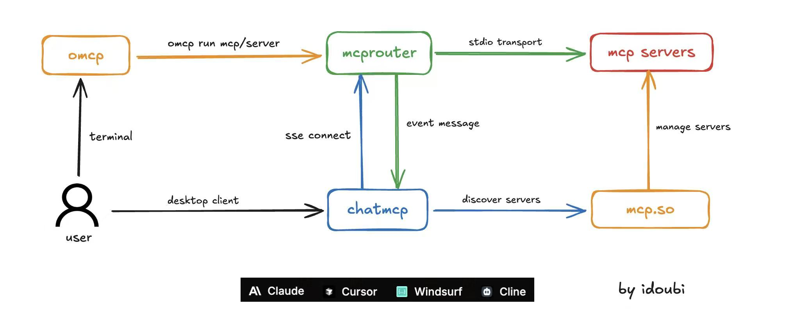

# mcprouter

OpenRouter for MCP Servers



## Start Proxy Server

1. edit config file

```shell
cp .env.example.toml .env.toml
```

edit `.env.toml` as needed.

2. start proxy server

```shell
go run main.go proxy
```

3. add Proxy URL to MCP Client like Cursor

`http://localhost:8025/sse/fetch`

make sure you have set `mcp_server_commands.fetch` in `.env.toml`

## Start API Server

1. edit config file

```shell
cp .env.example.toml .env.toml
```

edit `.env.toml` as needed.

2. start api server

```shell
go run main.go api
```

3. request api with curl

```shell
curl -X POST http://127.0.0.1:8027/v1/list-tools \
-H 'Content-Type: application/json' \
-H 'Authorization: Bearer fetch'
```

make sure you have set `mcp_server_commands.fetch` in `.env.toml`
